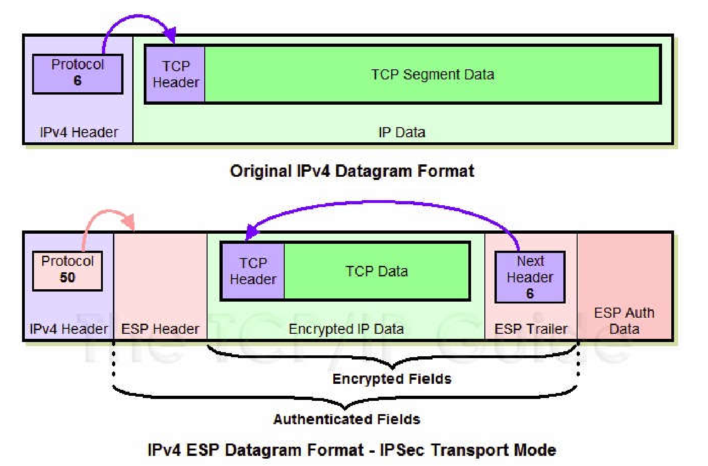
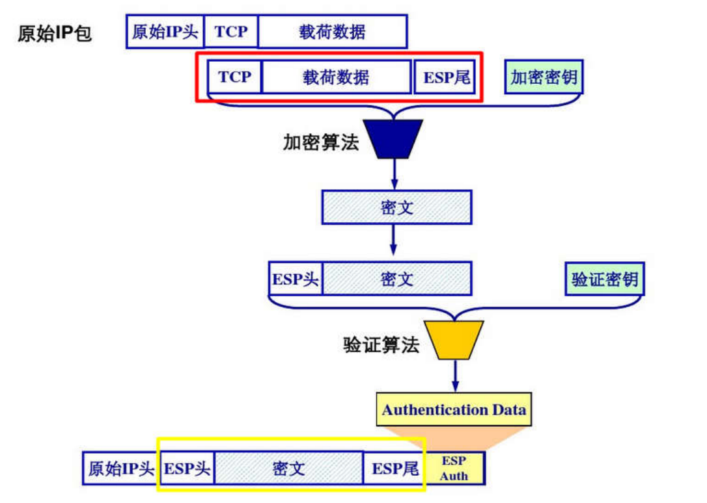

# IPSec传输模式：ESP报文的装包与拆包过程

## 一、前言  
互联网安全协议(Internet Protocol Security, IPSec)是由IEIF设计的一种端到端的确保IP层通信安全的机制，实质上是透过对IP协议的分组进行加密和认证来保护IP协议的网络传输协议族。

### **IPSec的主要协议**
1. 认证头AH (Authentication Headers)  
   AH协议能够在数据的传送过程中对数据进行完整性度量和来源认证，还可以防止回放攻击。
2. 封装安全载荷ESP (Encapsulating Security Payloads)  
   ESP协议能够在数据的传输过程中对数据进行完整性度量和来源认证，可以选择加密，也可以选择防止回放保护。

### **IPSec的两种模式**  
**Tunnel Mode 隧道模式**  
隧道模式下 IPsec 将要发送的原始 IP 报文作为数据内容，在这段数据前面加上 ESP 或 AH 协议头，再加上新的 IP 头，形成 IPsec 报文进行传输。  
原始 IP 报文的传输就像在一个安全的隧道中进行一样。在整个传输过程中，原报文保持原有的完整结构，内容没有被修改。  
**Transport Mode 传输模式**  
传输模式下 IPsec 保护的仅仅是原始 IP 报文的数据内容部分 (即 IP 报文的有效载荷)，而不是整个原报文。在这个过程中原报文结构被修改。  
在处理方法上，原 IP 报文被拆解，在其有效载荷前面加上新的
ESP 或 AH 协议头，再装回原来的 IP 地址，形成 IPsec 报文。

---

## 二、IPSec传输模式下，ESP报文的装包与拆包过程  
原IP报文和封装后的ESP报文对比：  
  
原IP报文由一个IP header和载荷数据组成。封装后，IP header保持不变，对原来的载荷数据以及ESP尾部进行了加密，并添加了ESP header、末尾附加完整性度量结果(ICV，Integrity check value)。  

ESP报文的装包过程流程图如下：  
  

###  **ESP报文的装包过程**  
1. 在原始 IP 报文的数据内容部分(即有效载荷)末尾添加ESP trailer(ESP 尾部)。ESP尾部包含三部分，分别是是否填充Padding, 填充长度Pad Length, 指向原报文协议类型的Next Header。  
2. 将有效载荷以及 ESP trailer 作为一个整体进行加密封装。具体的加密算法与密钥由 SA (Security Associations 安全关联) 给出。  
3. 给得到的加密数据添加一个ESP header。ESP header由 SPI 和 Seq# 两部分组成。加密数据与ESP header 合称为 Enchilada，构成认证部分。  
   > SPI，Security Parameter Index安全参数索引，用于将收到的 IPsec 数据包与其对应的SA进行关联，从SAD中获得关于该IPsec包一些信息如协议所有的算法和密钥  
   Seq#，Sequence number序号，占32比特，SA 初次建立时置0，每发送一个数据包加1，用于抵抗回放攻击
4. 附加完整性度量结果(ICV，Integrity check value)。对 Enchilada 部分做认证，得到一个32位整数倍的完整性度量值(MAC)，并附在ESP报文的尾部。完整性度量算法包括需要的认证密钥由 SA 给出。  
5. 将原始 IP 报文的 IP header 附在 ESP 报文的前面组成一个新的 IP 报文。

###  **ESP报文的拆包过程**  
1. 接收方收到 IP 报文后，查看协议类型，若是50则表明这是一个 ESP 包。
2. 首先查看 ESP header，通过 SPI 决定数据报文所对应的 SA ，获得对应的模式(tunnel/transport mode) 以及安全规范。
3. 计算 Enchilada 部分的摘要，与附在末尾的 ICV 做对比，验证数据完整性。
4. 检查 Seq# 里的序号，保证数据不是回访攻击。 
5. 根据 SA 所提供的加密算法和密钥，对加密数据进行解密，得到原 IP 报文与ESP trailer。
6. 根据 ESP trailer 的填充长度信息，找出填充字段，删去填充内容后得到原原始 IP 报文的有效载荷。
7. 将IP header和有效载荷组合即可得到封装前的 IP 报文。