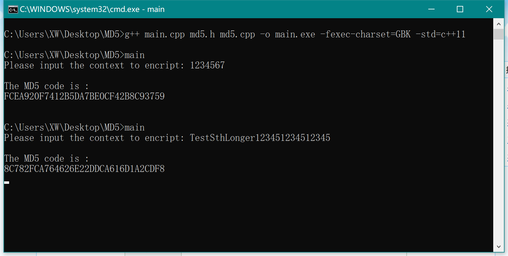
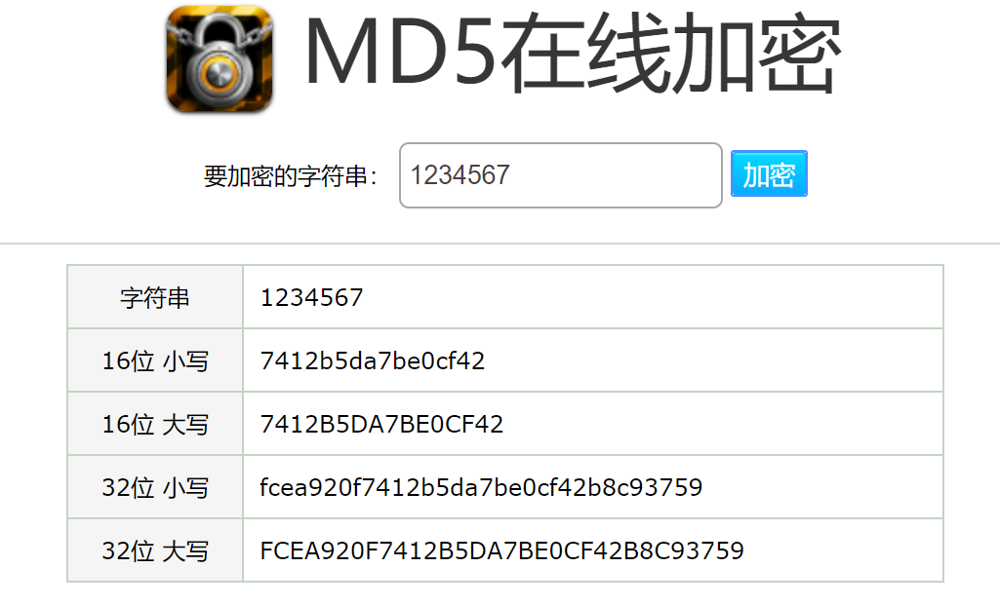
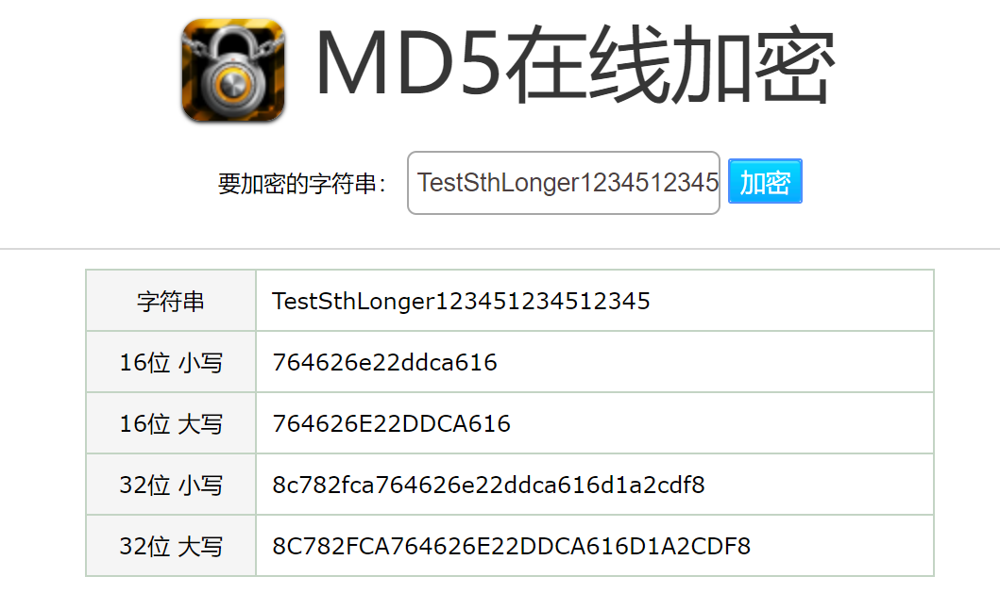

# WebSecurity-MD5 Encryption
Implementation of MD5 Encryption in C++

## 一、算法原理概述 / 总体结构

MD5消息摘要算法（MD5 Message-Digest Algorithm），是一种被广泛使用的密码散列函数，对于输入的信息，可以产生出一个256位（32字节）的哈希值，用于确保信息传输完整一致。不同的输入得到的结果不同，因此MD5可以用于数字签名防止篡改、抵赖等。  

对MD5算法简要的叙述可以为：MD5以每512位为一个分组来处理输入的信息，且每一分组又被划分为16个32位子分组，经过了一系列的处理后，算法的输出由四个64位分组组成，将这四个64位分组级联后将生成一个256位哈希值。

MD5算法步骤概述：  
1. **预处理** 首先填充信息，使得信息的位长度len对512求余得448，或者说扩展信息至 (K\*512+448)位=（K\*64+56)字节。具体操作是在信息末尾补一个1，之后全补0。在这填充结果之后再补充上原数据长度，用一个uint64表示数据长度B（两个int表示），超过64位则取低64位。这时数据就被填充为长度K\*512（448+64=512）位。
2. **分组处理** 把消息分为512位（64字节）为一组进行处理。以下面4个常数为起始变量进行计算，重新输出4个变量，以这四个变量再进行下一个分组的计算，如果已经是最后一个分组，这四个变量为最后结果，即MD5值。
    ```C++
    /* 四个32位整数ABCD用来计算信息摘要，初始化使用16进制表示数字
    四个数的物理顺序是 A=0x01234567，B=0x89ABCDEF，C=0xFEDCBA98，D=0x76543210
    不过 MD5 在计算的时候使用了小端序，因此表示如下：*/
    A = 0x67452301 
    B = 0xEFCDAB89 
    C = 0x98BADCFE 
    D = 0x10325476
    ```
3. **每组的子分组计算** 对于每一个512位的组，将其再分成16个32位的子分组，然后一共进行4轮变换，每轮变换进行16次函数计算。

## 二、数据结构  
设计一个计算md5值的类，成员变量包括输入信息、源信息长度、md5结果值、4个计算信息摘要的变量ABCD等，成员函数包括填充函数、分组计算函数等。
```C++
class md5{
    private:
        string text;                // 输入信息
        string code;                // md5值
        unsigned int length;        // 源信息长度
        unsigned int fillLength;    // 补全后字符串长度
        unsigned int A = 0x67452301, 
            B = 0xEFCDAB89, 
            C = 0x98BADCFE, 
            D = 0x10325476;         // 小端类型

    public:
        md5(string _init);          // 构造函数 
        string getCode();           // 获取md5值

    private:
        void fill();                                    // 填充函数
        void loop();                                    // 512位分组处理函数
        string converse(unsigned int num);              // 转换为小端序函数
        void AccLoop(unsigned int *seed, string group); // 子分组计算函数
};
```

## 三、模块分解

### 1. **预处理**  
在`fill()`函数中实现预处理 - 填充信息。  
参照伪代码：
```C++
//Pre-processing:
append "1" bit to message
append "0" bits until message length in bits ≡ 448 (mod 512)
append bit length of message as 64-bit little-endian integer to message
``` 
首先是补位。信息中的字符都是1字节（即8位），在填充信息时，可以同样以字节为单位填充。先在信息尾部加上 `10000000` 代表的字符，再填充若干`00000000`代表的字符。
```C++
    text += char(0x80);                     // 先补上10000000
    for (int i = 0; i < fillByte-1; i++)
        text += char(0x00);                 // 往后继续补00000000
```
然后填充源数据长度。数据长度的单位是bit，并且要以小端序填充。
```C++
    unsigned int temp = length * 8;  // 长度以字节为单位
    for (int i = 0 ; i < 8; i++) {
        text += char(temp & 0xff);      // 补充64位=8字节的信息长度，每次填充取低8位
        temp = temp >> 8;
    }      
```

### 2. **分组处理**  
在`loop()`函数中实现分组处理。  
参照伪代码：
```C++
//Initialize variables:
var int h0 := 0x67452301
var int h1 := 0xEFCDAB89
var int h2 := 0x98BADCFE
var int h3 := 0x10325476

//Process the message in successive 512-bit chunks:
for each 512-bit chunk of message
    break chunk into sixteen 32-bit little-endian words w[i], 0 ≤ i ≤ 15

    //Initialize hash value for this chunk:
    var int a := h0
    var int b := h1
    var int c := h2
    var int d := h3

    //Main loop:
    // ... Calculating a,b,c,d

    //Add this chunk's hash to result so far:
    h0 := h0 + a
    h1 := h1 + b 
    h2 := h2 + c
    h3 := h3 + d
End ForEach
```
以A，B，C，D四个数为起始变量进行计算，得出4个计算结果，加上4个及算你结果后，再进行下一个分组的计算，直到计算完最后一个分组，则A，B，C，D将用于表示MD5值。
```C++
    for (unsigned int i = 0; i < loopNum; i++) {     
        unsigned int *seed = new unsigned int[4] {A, B, C, D};   
        AccLoop(seed, text.substr(i * 64, 64));
        A += seed[0];
        B += seed[1];
        C += seed[2];
        D += seed[3];
    }
```
### 3. **子分组计算**  
在`AccLoop()`函数中实现子分组计算。  
参照伪代码：
```C++
    //Main loop:
    for i from 0 to 63
        if 0 ≤ i ≤ 15 then
            f := (b and c) or ((not b) and d)
            g := i
        else if 16 ≤ i ≤ 31
            f := (d and b) or ((not d) and c)
            g := (5×i + 1) mod 16
        else if 32 ≤ i ≤ 47
            f := b xor c xor d
            g := (3×i + 5) mod 16
        else if 48 ≤ i ≤ 63
            f := c xor (b or (not d))
            g := (7×i) mod 16
 
        temp := d
        d := c
        c := b
        b := leftrotate((a + f + k[i] + w[g]),r[i]) + b
        a := temp
    Next i
```

一个MD5运算由类似的64次循环构成，分成4轮*16次，如下图所示。F表示一个非线性函数，一个函数运算一次。Mi 表示一个32位的输入数据，Ki 表示一个32位的常数，用来完成每次不同的计算。可以概述为`tmp = B+((A+F(B,C,D)+Mj+Ki)<<<s)`, `A=D`, `D=C`, `C=B`, `B=tmp`  


在程序中，可以先用宏定义定义几个简单函数，包括四个在每次计算中都会用到的非线性函数F,G,H,I（每轮循环一个），以及一个左移函数。
```C++
#define F(x, y, z) (x & y) | ((~x) & z)
#define G(x, y, z) (x & z) | (y & (~z))
#define H(x, y, z) x ^ y ^ z
#define I(x, y, z) y ^ (x | (~z))

#define SHIFT_LEFT(a, s) ((a << s) | (a >> (32 - s)))
```

另外，M表示一个子分组，长度为32位即4字节 (512bits/16=32bits)。K可以由`k[i] := floor(abs(sin(i + 1)) × 2^32)`计算。

具体计算：
```C++
    unsigned int i1 = seed[0],  i2 = seed[1], 
                i3 = seed[2], i4 = seed[3], 
                temp;

    // 计算开始
    for (int k = 0 ; k < 4; k++)        // 四轮循环
        for (int i = 0; i < 16; i++) {  // 每轮循环执行16次函数
            switch (k) {
                case 0:
                    temp = F(i2, i3, i4);
                    break;
                case 1:
                    temp = G(i2, i3, i4);
                    break;
                case 2:
                    temp = H(i2, i3, i4);
                    break;
                case 3:
                    temp = I(i2, i3, i4);
                    break;
            }
            temp += i1 +  M[indexArr[k][i]] + T[k * 16 + i];
            temp = SHIFT_LEFT(temp, shiftArr[k][i % 4]);
            temp = temp + i2;
            
            i1 = i4;
            i4 = i3;
            i3 = i2;
            i2 = temp;
        }

    seed[0] = i1;
    seed[1] = i2;
    seed[2] = i3;
    seed[3] = i4;
```

### 4. **将计算结果转换为小端序**  

在`converse()`函数中实现将计算结果的A,B,C,D转换为小端序。
```C++
string md5::converse(unsigned int num) {
    unsigned int tmp;
    string result;
    char buf[4];
    for (int i = 0; i < 4; i++) {
        tmp = num & 0xff;
        sprintf(buf, "%02X", tmp); 
        num = num >> 8;
        result += buf;
    }
    return result;
}
```

### 5. **获取MD5值**
调用以上几个方法即可，依次是填充、循环计算、转换为小端序存储结果。
```C++
string md5::getCode() {
    fill();
    loop();
    code = converse(A) + converse(B) + converse(C) + converse(D); 
    return code;
}
```

## 四、C++源代码

main.cpp
```C++
#include <iostream>
#include <string>
#include "md5.h"

using namespace std;

int main(int argc, char const *argv[])
{
    cout << "Please input the context to encript: ";
    string context;
    cin >> context;
    md5 code = md5(context);
    cout << endl << "The MD5 code is : " << endl << code.getCode() << endl;
    getchar();
    getchar();
    return 0;
}
```  

md5.h
```C++
#ifndef MD5_H
#define MD5_H

#include <string>
#include <cmath>
using namespace std;

#define F(x, y, z) (x & y) | ((~x) & z)
#define G(x, y, z) (x & z) | (y & (~z))
#define H(x, y, z) x ^ y ^ z
#define I(x, y, z) y ^ (x | (~z))

#define SHIFT_LEFT(a, s) ((a << s) | (a >> (32 - s)))

class md5{
    private:
        string text;                // 字符串
        string code;                // md5值
        unsigned int length;        // 源字符串长度
        unsigned int fillLength;    // 补全后字符串长度
        unsigned int A = 0x67452301, 
            B = 0xEFCDAB89, 
            C = 0x98BADCFE, 
            D = 0x10325476;         // 小端类型

    public:
        md5(string _init);          // 构造函数 
        string getCode();           // 获取md5值

    private:
        void fill();                                    // 填充函数
        void loop();                                    // 512位分组处理函数
        string converse(unsigned int num);              // 转换为小端序函数
        void AccLoop(unsigned int *seed, string group); // 子分组计算函数
};

#endif
```

md5.cpp
```C++
#include "md5.h"

// public
md5::md5(string _init) {
    text = _init;           // 源字符串
    length = text.length(); // 源字符串长度
    code = "";              // 初始md5值为空
}

string md5::getCode() {
    fill();
    loop();
    code = converse(A) + converse(B) + converse(C) + converse(D); 
    return code;
}

string md5::converse(unsigned int num) {
    unsigned int tmp;
    string result;
    char buf[4];
    for (int i = 0; i < 4; i++) {
        tmp = num & 0xff;
        sprintf(buf, "%02X", tmp); 
        num = num >> 8;
        result += buf;
    }
    return result;
}

// private:
void md5::fill() {
    int fillBit = 448 - ((length * 8) % 512);           // 需要补位的位数
    int fillByte = fillBit == 0 ? 512 : fillBit / 8;    // 需要补位的字节数

    text += char(0x80);                     // 先补上10000000
    for (int i = 0; i < fillByte-1; i++)
        text += char(0x00);                 // 往后继续补00000000

    unsigned int temp = length * 8; // 长度以字节为单位
    for (int i = 0 ; i < 8; i++) {
        text += char(temp & 0xff);  // 补充64位/8字节的信息长度，每次填充取低8位
        temp = temp >> 8;
    }      
}

void md5::loop() {
    fillLength = text.length();
    unsigned int loopNum = fillLength / 64;                 // 每512位（64字节）为一组

    for (unsigned int i = 0; i < loopNum; i++) {     
        unsigned int *seed = new unsigned int[4] {A, B, C, D};   
        AccLoop(seed, text.substr(i * 64, 64));
        A += seed[0];
        B += seed[1];
        C += seed[2];
        D += seed[3];
    }
}

void md5::AccLoop(unsigned int *seed, string group) {
    int indexArr[4][16] = { 
        { 0, 1, 2, 3, 4, 5, 6, 7, 8, 9, 10, 11, 12, 13, 14, 15 },
        { 1, 6, 11, 0, 5, 10, 15, 4, 9, 14, 3, 8, 13, 2, 7, 12 },
        { 5, 8, 11, 14, 1, 4, 7, 10, 13, 0, 3, 6, 9, 12, 15, 2 },
        { 0, 7, 14, 5, 12, 3, 10, 1, 8, 15, 6, 13, 4, 11, 2, 9 }
    };
    int shiftArr[4][4] = {
        { 7, 12, 17, 22 },
        { 5, 9, 14, 20 },
        { 4, 11, 16, 23 },
        { 6, 10, 15, 21 }
    };

    // Ti
    unsigned int T[64];
    for (int i = 0; i < 64; i++) {
        T[i] = (unsigned int)(0x100000000UL * abs(sin((double)(i + 1))));
    }

    // 将64字节划分为16组4字节(32位)，转换为数字
    unsigned int M[16];
    for (int i = 0; i < 16; i++) {
        string sub = group.substr(i * 4, 4);
        M[i] = (((sub[3]&0xff) << 24) + ((sub[2]&0xff) << 16) + ((sub[1]&0xff) << 8) + (sub[0]&0xff));
    }

    unsigned int i1 = seed[0], 
                i2 = seed[1], 
                i3 = seed[2], 
                i4 = seed[3], 
                temp;

    // 计算开始
    for (int k = 0 ; k < 4; k++)        // 四轮循环
        for (int i = 0; i < 16; i++) {  // 每轮循环执行16次函数
            switch (k) {
                case 0:
                    temp = F(i2, i3, i4);
                    break;
                case 1:
                    temp = G(i2, i3, i4);
                    break;
                case 2:
                    temp = H(i2, i3, i4);
                    break;
                case 3:
                    temp = I(i2, i3, i4);
                    break;
            }
            temp += i1 +  M[indexArr[k][i]] + T[k * 16 + i];
            temp = SHIFT_LEFT(temp, shiftArr[k][i % 4]);
            temp = temp + i2;
            
            i1 = i4;
            i4 = i3;
            i3 = i2;
            i2 = temp;
        }

    seed[0] = i1;
    seed[1] = i2;
    seed[2] = i3;
    seed[3] = i4;
}
```

## 五、编译运行结果

运行结果：  
  

在线检验：  

  

