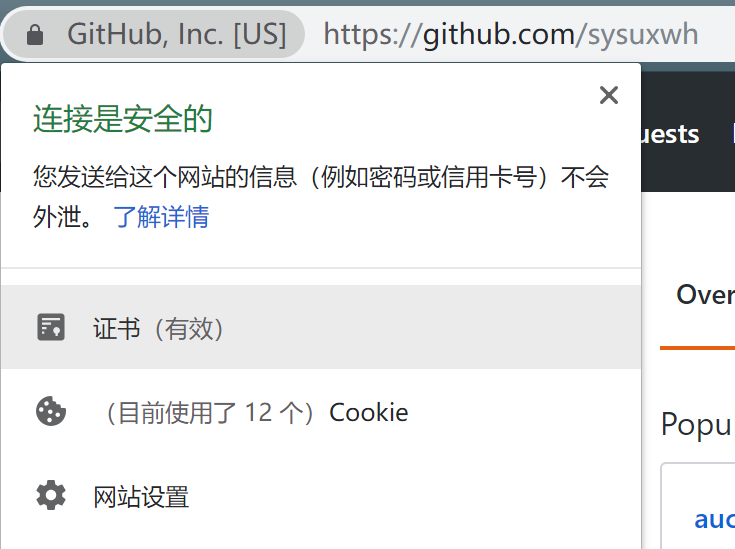
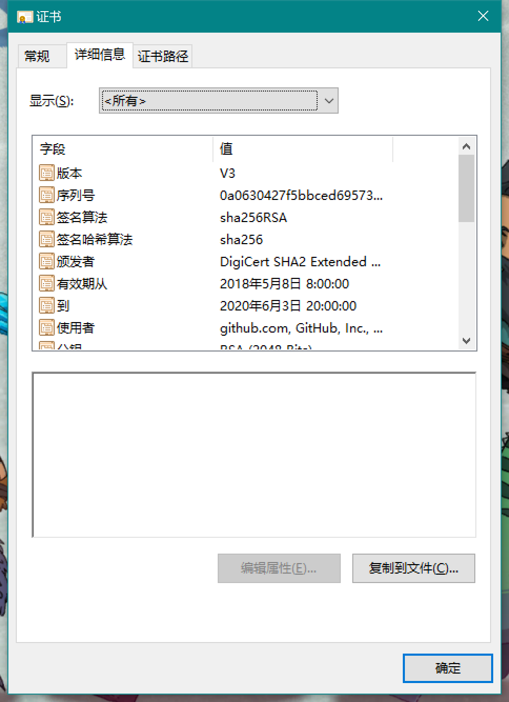
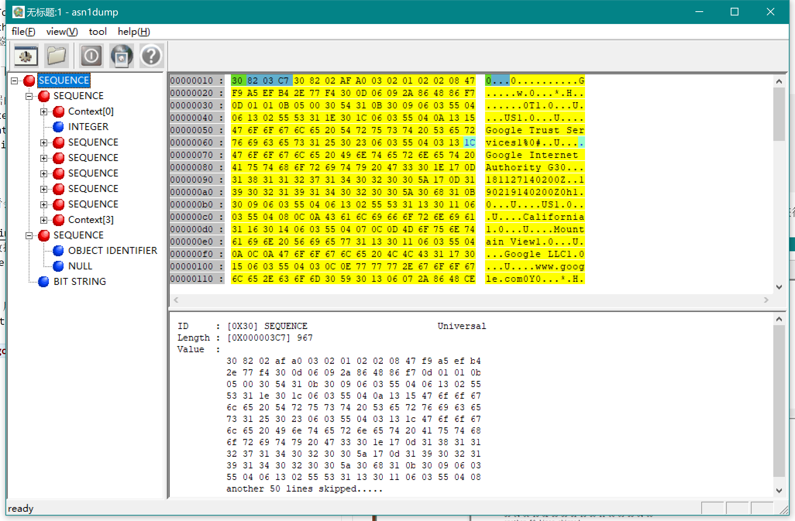
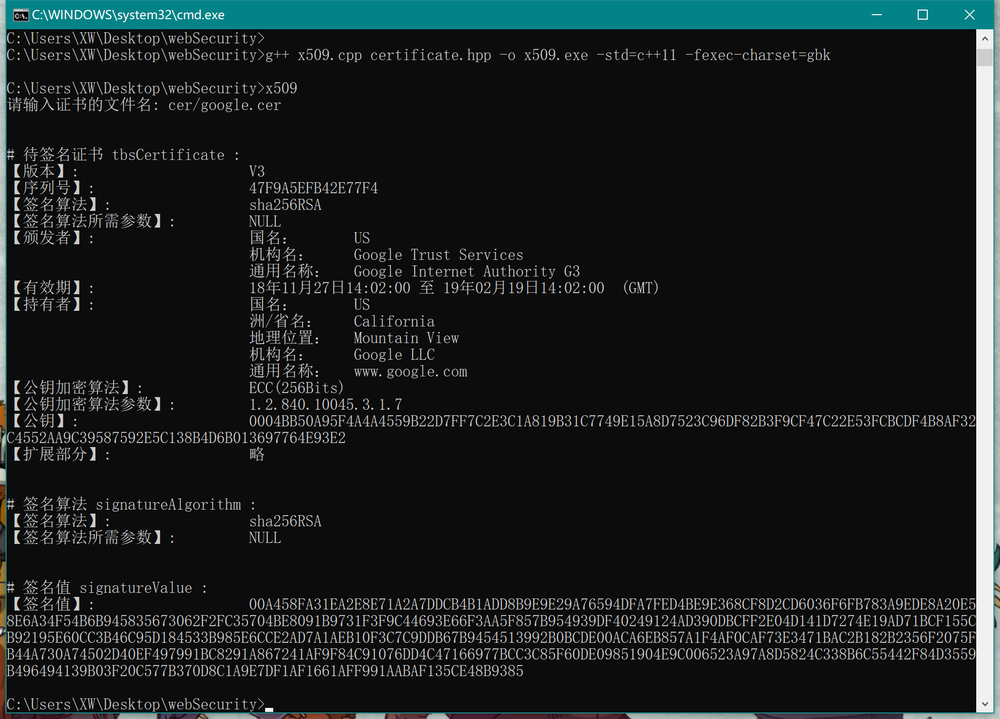
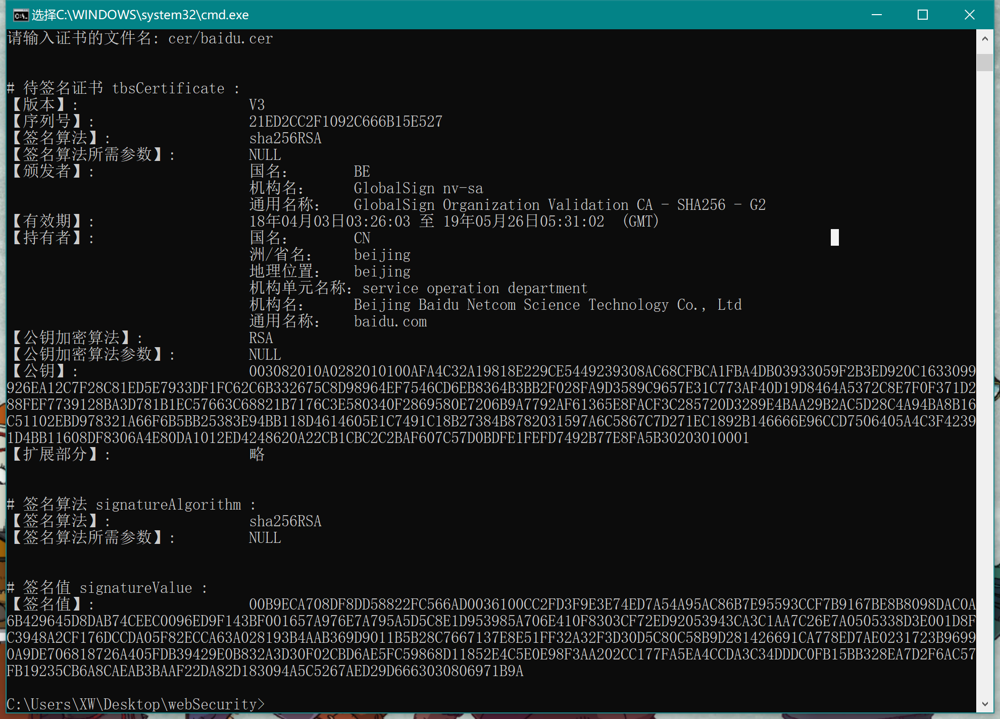

# X.509数字证书解析

## 一、**X.509数字证书的获取**  
以Chrome浏览器为例，打开一个网站，然后点击地址栏的最左边，可以获取该网址的证书。点击之后，选择 详细信息 - 复制到文件 - 下一步 - DER编码二进制X.509 - 输入导出文件名， 就可以获取X.509数字证书了。  
  
点击证书文件可以看到更多的信息。  
  

---

## 二、**X.509数字证书的编码**

X.509证书的结构是用ASN1(Abstract Syntax Notation One)进行描述数据结构，并使用ASN1语法进行编码。

ASN1采用一个个的数据块来描述整个数据结构，每个数据块都是基于8位编码的TLV三元组<Type,Length,Value>，即是类型、长度、值：

#### 1. Type: 数据块的数据类型标识(1 byte)  
数据类型包括简单类型以及结构类型。简单类型就是不能再分解的类型，如INTEGER, BIT STRING等，结构类型是由简单类型和结构类型组合而成的，如SEQUENCE, CHOICE等。

数据类型是定长的，即1字节/8位。ASN.1提供的类型有32种，其中包含一些保留值。

#### 2. Length: 数据块长度(1 - 128 bytes)  
长度字段，有两种编码格式。若长度值小于等于127，则用一个字节表示，第8位为0, 剩下七位存放长度值；若长度值大于127，则用多个字节表示，可以有2到127个字节。第一个字节的第8位为1，其它低7位给出后面该域使用的字节的数量，从该域第二个字节开始给出数据的长度，高位优先。

还有一种特殊情况，这个字节为0x80，表示数据块长度不定，由数据块结束标识 0x0000 结束数据块。

#### 3. Value: 数据块的值  
存放数据块的值，具体编码随数据块类型不同而不同。

---

## 三、**X.509数字证书的结构**
X.509数字证书用ASN.1语法描述如下：
```
Certificate ::= SEQUENCE {
    tbsCertificate      TBSCertificate,
    signatureAlgorithm  AlgorithmIdentifier,
    signatureValue      BIT STRING
}
```
一个证书对象里面包含了3个类型的值，分别是：
* tbsCertificate(To Be Signed Certificate) 待签名证书
* signatureAlgorithm 签名算法
* signatureValue 签名值

用ASN.1的形式表示如下：
```
<SEQUENCE, 证书数据的长度,
	<TBSCertificate，tbsCertificate长度，<数据> >
	<AlgorithmIdentifier，signatureAlgorithm长度，<数据> >
	<BIT STRING，signatureValue的长度,<数据> >
>
```

从一个实际的例子来看会比较好了解。通过asn1dump解析软件，打开一个证书，可以获得如下信息：  

左边的列表是证书的数据嵌套。最基层的SEQUENCE就是Certificate，包含SEQUENCE类型的tbsCertificate和signatureAlgorithm，最后的BIT STRING是证书的签名值。

右边则是具体的数据，用16进制表示。绿色表示数据类型，蓝色表示数据长度，黄色表示值。当前的Certificate数据类型是30(Sequence)，长度967。

X.509数字证书的完整结构为：
```
证书-
    - 待签名证书
        - 版本号
        - 序列号
        - 算法标识
        - 颁发者
        - 有效期
        - 持有者
        - 公钥信息
        - 签发者唯一标识符
        - 主体唯一标识符
    - 签名算法
    - 签名值
```

### **待签名证书 tbsCertificate**
```
TBSCertificate ::= SEQUENCE {
    version           [0]   EXPLICIT Version DEFAULT v1,
    serialNumber            CertificateSerialNumber,
    signature               AlgorithmIdentifier,
    issuer                  Name,
    validity                Validity,
    subject                 Name,
    subjectPublicKeyInfo    SubjectPublicKeyInfo,
    issuerUniqueID    [1]   IMPLICIT UniqueIdentifier OPTIONAL,
    subjectUniqueID   [2]   IMPLICIT UniqueIdentifier OPTIONAL,
    extensions        [3]   EXPLICIT Extensions OPTIONAL
}
```
接下来将逐个字段的解析。  

1. version - 版本号  
   第一个字段的数据类型是Context[0]，其下包含一个INTEGER类型的数据，就是该证书的版本号。证书格式的版本共有v1, v2, v3三种，分别由整数0、1、2表示。
2. serialNumber - 序列号  
   整数序列号为INTEGER类型，整数序列号用来在某一个CA范围内唯一地标识一张证书。由此，“颁发者”和“序列号”配合起来可以唯一标识一张数字证书。将Value的值用16进制数表示即是序列号。
3. signature - 签名算法
   签名算法给出了CA签发证书时所使用的数字签名算法，数据类型为AlgorithmIdentifier，和signatureAlgorithm保持数据类型和值一致。
   ```
    AlgorithmIdentifier  ::=  SEQUENCE  {
        algorithm        OBJECT IDENTIFIER,
        parameters       ANY DEFINED BY algorithm OPTIONAL  
    }
   ```
   比较有意思的是需要将VALUE的串转换为OID，具体转换方法参考[16进制数串转换为OID方法](https://crypto.stackexchange.com/questions/29115/how-is-oid-2a-86-48-86-f7-0d-parsed-as-1-2-840-113549)。每一个OID都对应着一种算法，如1.2.840.113549.1.1.1表示RSA算法，因此再根据OID判断签名算法即可。。
4. issuer - 颁发者  
   证书的颁发者标识了签发证书的CA实体，数据类型为Name。
   ```
    Name ::= CHOICE{
        RDNSequence
    }
    RDNSequence ::= SEQUENCE OF RelativeDistinguishedName
    RelativeDistinguishedName ::= SET OF AttributeTypeAndValue
    AttributeTypeAndValue ::= SEQUENCE{
        type    AttributeType,
        value   AttributeValue
    }
    AttributeType::=OBJECT IDENTIFIER
    AttributeValue::=ANY DEFINED BY AttributeType
   ```
   数据类型Name其实是一些DN项（Distinguish Name）的集合，每一项DN项包括一个OID（指向属性类型名称）以及一个表示名字的字符串。常见的DN项有：
   |属性类型名称|含义|简写|
   |---|---|---|
   |Country|国名|C|
   |State of Province Name|州/省名|S|
   |Locality|地理位置|L|
   |Organization Name|机构名|O|
   |Organizationl Unit Name|机构单元名称|OU|
   |Common Name|通用名称|CN|
   读取的时候，先将AttributeType的值转换为OID，再根据OID判断DN项的属性类型名称；然后将AttributeValue的值按照ASCII码转换成对应英文字符即可。

5. validity - 有效期  
   证书有效期(validity)给出证书的有效使用期，包含起、止两个时间值。时间值的数据类型为utcTime，代表格林威治標準時間(GMT)。utcTime的Value转成ASCII码后表示形式为YYMMDDhhmmZ，依次是年月日时分秒，Z表示GMT时间。
6. subject - 持有者(主体)  
   证书主体(subject)标识了证书持有者的实体,持有者的数据类型和颁发者一样，同样是DN项的集合。
7. subjectPublicKeyInfo - 主体公钥信息  
   主体公钥信息给出了证书绑定的公钥信息，包括加密算法和公钥。
   ```
    SubjectPublicKeyInfo ::= SEQUENCE {
        algorithm           AlgorithmIdentifier,
        subjectPublicKey    BIT STRING
    }
   ```
   读取的时候，algorithm同样是AlgorithmIdentifier类型，参照上面的读取方式；BIT STRING类型的subjectPublicKey读取为16进制数形式。
8. issuerUniqueID & subjectUniqueID - 颁发者唯一标识符 & 主体唯一标识符(可选)  
   颁发者唯一标识符和主体唯一标识符均是BIT STRING类型的数据，用作颁发者/主体的唯一标识。这两个字段都仅在版本2和版本3的证书有要求，属于可选项。
9.  extensions - X.509证书扩展部分  
    可选的标准和专用的扩展（仅在版本2和版本3中使用），扩展部分的元素通常可包括颁发者密钥标识符、私钥的使用期、证书策略等等

## 四、**使用C++程序进行证书解析**  
  分别从 https://www.google.com 和 https://www.baidu.com 获取DER编码二进制X.509证书，使用程序进行解析。解析结果如下：  
    
  
